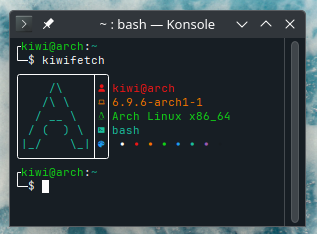

# Kiwifetch
---
A small fetch script written only in Shell
---
## Install
1. clone the repo, or download as zip
2. run install.sh
## Usage:
- `kiwifetch` for system info
- `kiwifetch x` for custom logo
    - arch
    - ubu
    - deb
    - pop
    - fedo
    - mint 
## Info:
- User@Host
- Kernel Release
- Distro
- Shell
- Terminal Colors

