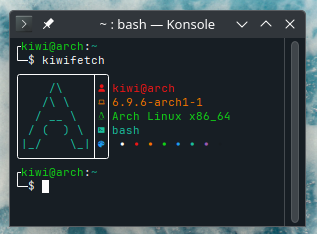

# Kiwifetch
---
A small fetch script written only in Shell
---
## Install
1. clone the repo, or download as zip
2. run install.sh
## Info:
- User@Host
- Kernel Release
- Distro
- Shell
- Terminal Colors

